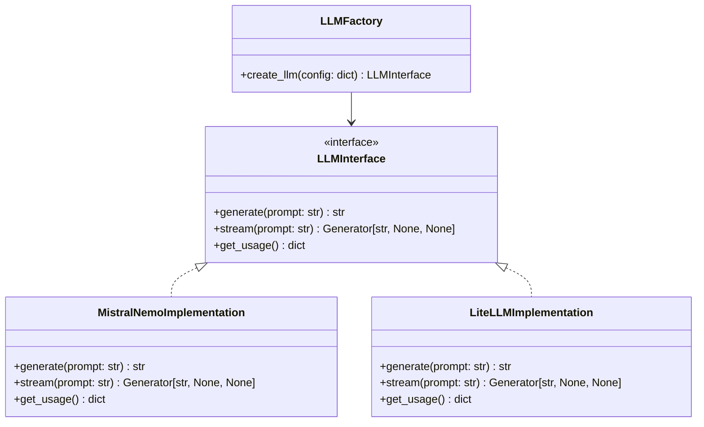
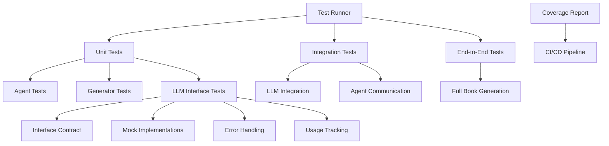
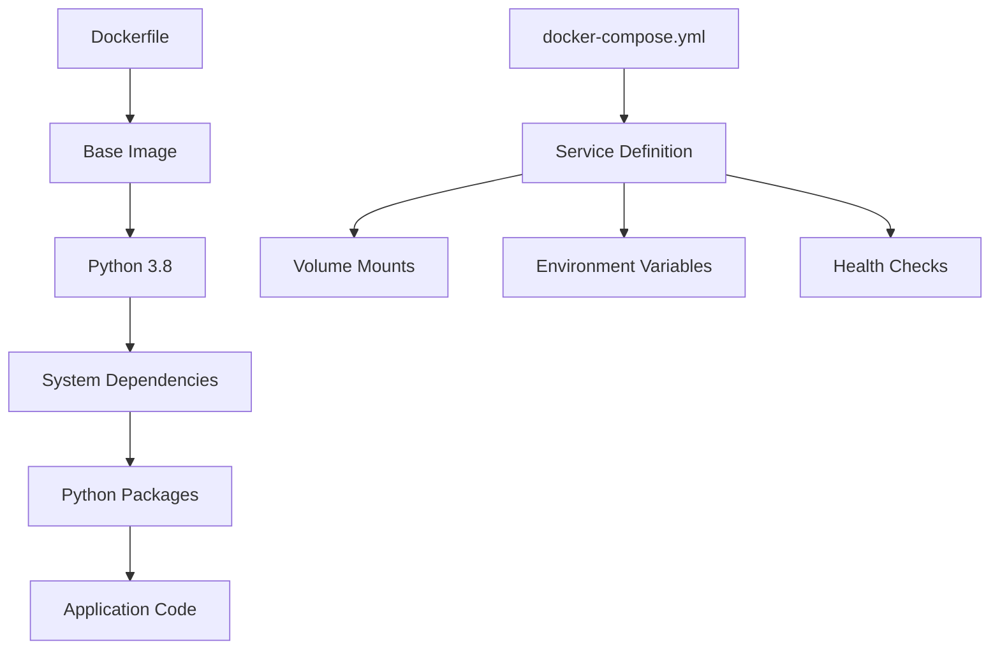
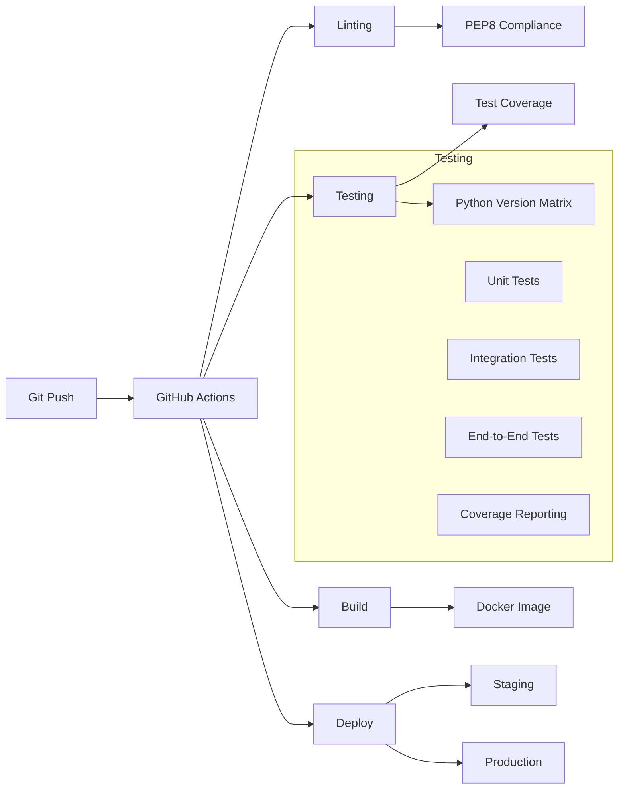

# Development Documentation

## Current Architecture

The AutoGen Book Generator is a Python-based system that uses multiple AI agents to collaboratively generate books. The system is built on Microsoft's AutoGen framework and employs a multi-agent architecture for distributed responsibility and specialized tasks.

### Core Components

1. **Configuration System** (`config.py`)
   - Manages LLM configurations and agent settings
   - Currently configured for local LLM (Mistral-Nemo-Instruct-2407)
   - Provides centralized configuration management

2. **Agent System** (`agents.py`)
   - Implements specialized AI agents:
     - Story Planner: High-level narrative structure
     - World Builder: Setting and environment consistency
     - Memory Keeper: Continuity and context tracking
     - Writer: Prose generation
     - Editor: Content review and improvement
     - Outline Creator: Chapter structure planning
   - Maintains context and state through BookAgents class
   - Implements world-building and character development tracking

3. **Outline Generation** (`outline_generator.py`)
   - Manages the book outline creation process
   - Implements robust error handling and recovery
   - Ensures chapter completeness and sequencing
   - Validates outline structure and content requirements

4. **Book Generation** (`book_generator.py`)
   - Controls the main book generation process
   - Manages chapter generation and sequencing
   - Implements content verification and backup systems
   - Handles failure recovery and retry mechanisms

### Data Flow

1. Initial Configuration → Agent Creation
2. Outline Generation → Chapter Structure
3. Iterative Chapter Generation:
   - Context Preparation
   - Content Generation
   - Review and Editing
   - Verification and Storage

## Code Organization

```
.
├── agents.py           # Agent definitions and management
├── book_generator.py   # Main generation orchestration
├── config.py          # System configuration
├── main.py            # Entry point
├── outline_generator.py # Outline creation system
└── requirements.txt    # Dependencies
```

## Dependencies

- Python 3.8+
- AutoGen Framework
- Local LLM Setup (Mistral-Nemo-Instruct-2407)

## Current State Analysis

### Strengths

1. **Robust Architecture**
   - Well-defined agent responsibilities
   - Strong error handling
   - Backup and recovery systems

2. **Content Management**
   - Consistent chapter structure
   - Maintained continuity
   - Tracked world-building elements

3. **Process Control**
   - Verified chapter completion
   - Sequential generation
   - Content validation

### Areas for Improvement

1. **Code Quality and Testing**
   - No current test suite
   - Limited input validation
   - Need for comprehensive error handling
   - Could benefit from type hints and documentation

2. **Infrastructure**
   - No containerization
   - Missing CI/CD pipeline
   - Limited deployment documentation
   - No monitoring or logging system

3. **Features**
   - Limited configuration options
   - No progress tracking/visualization
   - Missing parallel processing capabilities
   - No user interface

4. **Documentation**
   - Limited API documentation
   - Missing deployment guides
   - No contribution guidelines
   - Incomplete system requirements

## Proposed Improvements

## LLM Interface Architecture

We've implemented a new interface pattern for LLM integration that provides:

1. **Abstraction**: The LLMInterface abstract base class defines a clear contract for LLM implementations
2. **Extensibility**: New LLM models can be added by implementing the interface
3. **Testability**: The interface makes it easier to mock LLM behavior in tests
4. **Consistency**: All LLM implementations follow the same pattern

### Key Components

- **LLMInterface**: Abstract base class defining required methods
- **MistralNemoImplementation**: Current implementation for Mistral-Nemo-Instruct
- **LLMFactory**: Factory class for creating LLM instances

### Adding New Implementations

1. Create a new class implementing LLMInterface
2. Add the new model to LLMFactory.create_llm()
3. Update configuration as needed

### Migration Notes

Existing code using the direct LLM implementation should be updated to:
1. Use create_llm() from config.py
2. Access LLM functionality through the interface methods
3. Handle errors according to the interface contract

### High Priority

1. **Enhanced LLM Integration and Flexibility**
   - Added connection testing capability
     - Implemented test_connection() method in LLMInterface
     - Added health check endpoint support
     - Implemented connection tests in MistralNemoImplementation
     - Added comprehensive test coverage
   - Implemented LiteLLM integration for multi-provider support
     - Supports OpenAI, DeepSeek, Gemini, and Groq
     - Configuration through environment variables
     - Fallback model support
     - Unified interface for all providers
   - Add custom prompting capabilities
   - Support fiction and non-fiction book types
   - Integrate optional RAG system for external knowledge sources
   - Add customizable chapter length controls
   - Implement character length constraints
   - Ensure seamless provider switching
   - Added prompt template management system
     - Supports Python format string syntax
     - Implements template validation
     - Includes template-based generation and streaming
     - Added comprehensive test coverage
     - Documentation in README.md
   - docx support with table of contents

2. **Testing Infrastructure**
   - Add unit tests for core components
   - Implement integration tests
   - Add test coverage reporting
   - Create testing documentation

3. **Containerization**
   - Create Dockerfile
   - Set up Docker Compose
   - Document container usage
   - Add container health checks

4. **CI/CD Pipeline**
   - Implement GitHub Actions
   - Add automated testing
   - Configure deployment pipeline
   - Set up version management

### Medium Priority

1. **Code Quality**
   - Add comprehensive type hints
   - Improve error handling
   - Implement logging system
   - Add code documentation

2. **Features**
   - Add progress tracking
   - Implement parallel processing
   - Create basic web interface
   - Add configuration validation

### Low Priority

1. **Documentation**
   - Create API documentation
   - Add deployment guides
   - Write contribution guidelines
   - Document system architecture

2. **Optimization**
   - Improve memory usage
   - Optimize processing speed
   - Add caching mechanisms
   - Implement resource management

## Next Steps

1. Create test suite infrastructure
2. Set up containerization
3. Implement CI/CD pipeline
4. Add comprehensive documentation
5. Implement high-priority features
   - LiteLLM integration
   - Custom prompting system
   - Fiction/non-fiction support
   - RAG integration
   - Chapter length customization
   - Character length controls

## Architectural Proposals

### LLM Integration Architecture


### Testing Architecture


### Containerization Architecture


### CI/CD Pipeline Architecture


### CI Pipeline Implementation

The CI pipeline is implemented using GitHub Actions with the following key features:

1. **Trigger Conditions**
   - Runs on push to main branch
   - Runs on pull requests to main branch

2. **Testing Matrix**
   - Tests across Python versions: 3.8, 3.9, 3.10
   - Runs on Ubuntu latest

3. **Key Steps**
   - Checkout code
   - Set up Python environment
   - Install dependencies
   - Run tests with coverage
   - Upload coverage to Codecov

4. **Configuration**
```yaml
name: CI Pipeline

on:
  push:
    branches: [ main ]
  pull_request:
    branches: [ main ]

jobs:
  test:
    runs-on: ubuntu-latest
    strategy:
      matrix:
        python-version: ["3.8", "3.9", "3.10"]

    steps:
    - uses: actions/checkout@v3
    
    - name: Set up Python ${{ matrix.python-version }}
      uses: actions/setup-python@v4
      with:
        python-version: ${{ matrix.python-version }}
    
    - name: Install dependencies
      run: |
        python -m pip install --upgrade pip
        pip install -r requirements.txt
        pip install pytest pytest-cov
        
    - name: Run tests
      run: |
        pytest --cov=./ --cov-report=xml
        
    - name: Upload coverage
      uses: codecov/codecov-action@v3
      with:
        token: ${{ secrets.CODECOV_TOKEN }}
        file: ./coverage.xml
        flags: unittests
        name: codecov-umbrella
        fail_ci_if_error: true
```

## Implementation Plan

1. **Phase 1: Core Refactoring**
   - Implement LLM interface and factory pattern
   - Add LiteLLM integration
   - Create base testing framework

2. **Phase 2: Infrastructure**
   - Implement Docker setup
   - Create CI/CD pipeline
   - Add monitoring and logging

3. **Phase 3: Optimization**
   - Implement parallel processing
   - Add caching mechanisms
   - Optimize resource usage

## Development Guidelines

1. **Code Style**
   - Follow PEP 8 guidelines
   - Use type hints
   - Add docstrings
   - Maintain consistent formatting

2. **Testing**
   - Write tests for new features
   - Maintain test coverage
   - Document test cases
   - Use pytest for testing

3. **Version Control**
   - Use feature branches
   - Write clear commit messages
   - Follow semantic versioning
   - Review code before merging

4. **Documentation**
   - Update docs with changes
   - Include code examples
   - Document breaking changes
   - Maintain changelog
