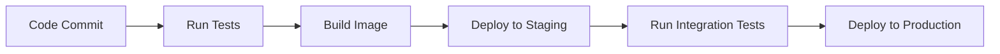

# Deployment Guide

## Requirements
- Python 3.9+
- Docker (optional)
- Redis (for caching)
- PostgreSQL (for persistent storage)

## Local Development Setup
1. Create virtual environment:
```bash
python -m venv venv
source venv/bin/activate
```

2. Install dependencies:
```bash
pip install -r requirements.txt
```

3. Configure environment variables:
```bash
cp .env.example .env
```

4. Run development server:
```bash
python main.py
```

## Production Deployment

### Docker Setup
```bash
docker-compose up -d
```

### Kubernetes Setup
```yaml
apiVersion: apps/v1
kind: Deployment
metadata:
  name: ai-book-writer
spec:
  replicas: 3
  template:
    spec:
      containers:
      - name: app
        image: ai-book-writer:latest
        ports:
        - containerPort: 8000
```

### CI/CD Pipeline


## Monitoring
- Prometheus metrics endpoint: `/metrics`
- Health check endpoint: `/health`
- Log aggregation with ELK stack
