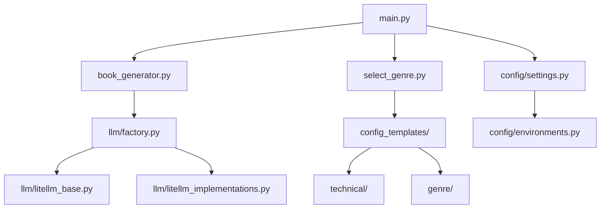

# Developer Guide

## Project Structure



## Key Components

### Core Modules
- **main.py**: Entry point for the application
- **book_generator.py**: Handles book generation logic
- **select_genre.py**: Manages genre selection and template loading

### Configuration
- **config/**: Contains all configuration files
  - settings.py: Main application settings
  - environments.py: Environment-specific configurations

### LLM Integration
- **llm/**: Language model integration layer
  - factory.py: LLM client factory
  - litellm_base.py: Base LLM implementation
  - litellm_implementations.py: Specific LLM implementations

### Templates
- **config_templates/**: Contains genre and technical templates
  - technical/: Technical writing templates
  - genre/: Fiction genre templates

## Development Workflow

1. Clone the repository
2. Set up development environment
3. Make changes in feature branches
4. Run tests
5. Submit pull requests

## Testing

Run all tests with:
```bash
pytest tests/
```

## Debugging

Enable debug mode in .env:
```bash
DEBUG=true
```

## Code Style

Follow PEP 8 guidelines and use pre-commit hooks:
```bash
pre-commit install
pre-commit run --all-files
```
