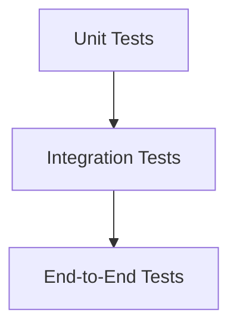

# Testing Strategy

## Test Pyramid



## Unit Tests
- Test individual components in isolation
- Mock external dependencies
- Focus on business logic

## Integration Tests
- Test component interactions
- Verify database and API integrations
- Test error handling scenarios

## End-to-End Tests
- Test complete user workflows
- Verify system behavior
- Include performance testing

## Test Coverage
- Aim for 80%+ coverage
- Focus on critical paths
- Use coverage reports:
```bash
pytest --cov=ai_book_writer tests/
```

## Continuous Integration
- Run tests on every commit
- Enforce coverage thresholds
- Automate test reporting
