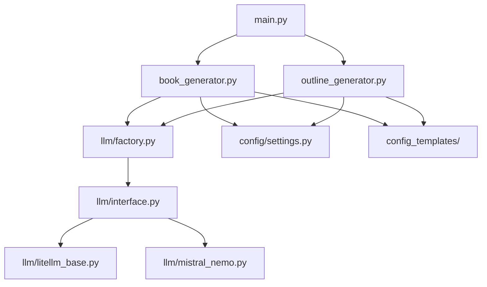

# AI Book Writer Repository Map

## Overview
This document provides a detailed explanation of the repository structure and the purpose of each file, along with a system architecture diagram.

## File Structure and Purpose

### Core Functionality
- `main.py` - Main entry point for the application
- `book_generator.py` - Handles book content generation
- `outline_generator.py` - Generates book outlines
- `llm/` - Contains LLM client implementations
  - `factory.py` - LLM client factory
  - `interface.py` - Common LLM interface
  - `litellm_base.py` - LiteLLM base implementation
  - `mistral_nemo.py` - Mistral/Nemo implementation
- `config/` - Configuration management
  - `settings.py` - Application settings
- `config_templates/` - Predefined book templates
  - Genre-specific templates (fantasy, romance, etc.)
  - Technical templates (computer science, physics, etc.)

### Supporting Files
- `pyproject.toml` - Python project configuration
- `requirements.txt` - Python dependencies
- `.env` - Environment variables
- `tests/` - Test suite
  - Unit tests for core functionality
- `utils/` - Utility functions

### Documentation
- `README.md` - Project overview
- `development.md` - Development guidelines
- `.change.log` - Change history
- `CONTRIBUTORS.md` - Contributor list
- `authors.md` - Author information
- `beginners.md` - Beginner's guide

## System Architecture Diagram

## Relationships
1. `main.py` coordinates the book generation process
2. Both book and outline generators use the LLM factory
3. The LLM factory provides access to different LLM implementations
4. Configuration and templates are shared across components
